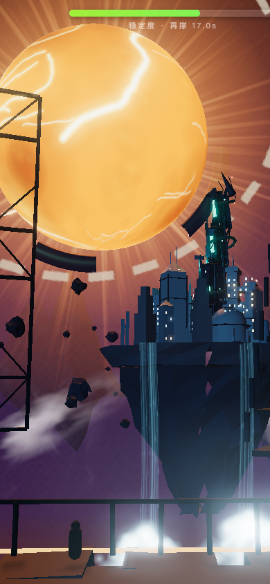

# 重力失控的城市 · Gravity Lost City

一款零依赖的 Three.js 重力平衡小游戏：城市的重力失控了，你需要操控平衡装置，在周期性来袭的「重力潮汐」中稳住城市，别让它坠落。



## 玩法

- 控制平衡装置，抵消不断偏移的重力，让城市保持 upright
- 开局数秒后进入 **M4 重力潮汐** 阶段：每约 7 秒一波潮汐会猛然把重力平衡推向一侧，需要及时反向补偿
- 撑不住就会坠落（fall），稳住即得分

## 运行

游戏本体是纯静态页面，Three.js 已本地化到 `vendor/three`，**无需 npm install、无需联网**：

```bash
# 方式一：直接用浏览器打开 index.html

# 方式二：本地预览服务器（零依赖，Node 自带模块）
npm run dev
# 默认 http://localhost:7100，支持参数：
node server.mjs --port 8080 --host 0.0.0.0
```

`--host 0.0.0.0` 下，同一 WiFi 的手机可直接访问电脑 IP 进行真机测试。

## 目录结构

```
index.html        游戏入口（importmap 指向本地 vendor/three）
src/              游戏逻辑 ES 模块（城市、重力、潮汐、针塔、瀑布、云层等）
vendor/three      本地化 Three.js（离线运行依赖）
server.mjs        极简静态文件服务器（仅本地预览用）
shots/            开发过程真机测试截图 + shot.sh 截图脚本
真机测试清单.md    真机回归测试清单
game-2d-v01.html  早期 2D Canvas 原型（存档）
```

## 技术要点

- Three.js ES Modules + importmap，无构建步骤
- 移动端优先：viewport-fit、触摸操作、禁用页面滚动/缩放
- 重力潮汐系统：随机间隔冲击 + 指数衰减（`TIDE_TAU`），教学提示用 localStorage 记录
